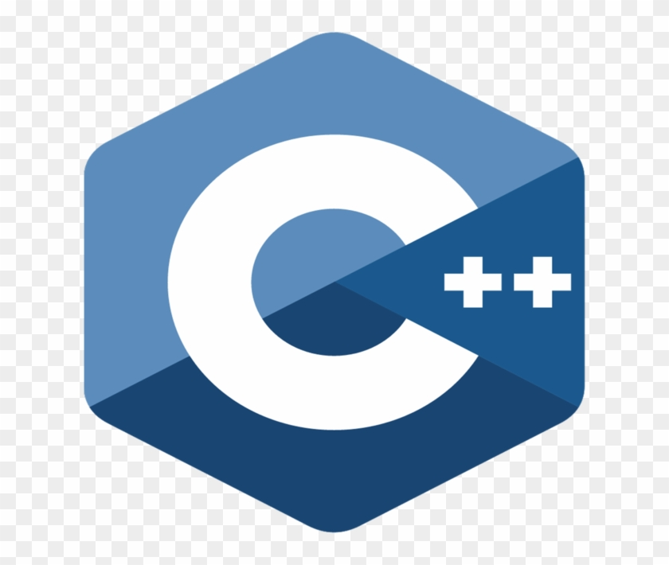
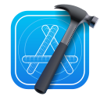

  <h1>Hi  I'm Deepak Kumar</h1>
  <h3>Software Developer | Web Developer | Freelancer | 4 years of Experience | Leadsquared Custom App,Lapps,Automation and Leadsquared Plateform Support</h3>

<em>PS: I am a committed and hardworking Software Developer with 4 years of experience. I thrive on challenges and consistently seek opportunities to enhance my skills. Working effectively in a team is one of my strengths, in addition to possessing strong programming abilities. I have extensive experience with CRM software such as Leadsquared API, custom portals,Lapps and automation. My drive and ambition make me a valuable asset to any organization. I am passionate about devising improved problem-solving methods for complex tasks and I am always eager to learn new technologies and tools as the need arises.</em>

# Talking about Personal Stuffs...

💻 Back-end: Node.js, Express.js, Django
🌐 Front-end: React.js, HTML, CSS
🔧 Programming Languages: JavaScript, Python, C++, Core Java
📚 Framework/Library: PySpark, Azure Databricks, Pandas, Redux, CORS
🛠️ Developer Tools: Git, Bitbucket, Visual Studio Code, PyCharm, Xcode, Confluence, Android Studio
🗄️ Databases: MongoDB, PostgreSQL
🔌 API: Leadsquared, Twilio
⚙️ DevOps: Amazon S3, Azure
🌟 Other: MERN stack, DSA, 3 rating on CodeChef
🤔 I’m Looking for: SDE Role
🔨 Currently working on: My project portfolio
😉 I'm Looking for: Article Writing
🦄 I'm Looking to Collaborate on: Open-Source Contributions
💬 Ask me about: Anything! [here](https://www.linkedin.com/in/kumardeepakkg/) Feel free to reach out to me on LinkedIn for any assistance.
😄 Pronouns: He/Him/His
  

   

 

<h1>💻 Things I know</h1>

<i>Tools, languages, and other things that I like to work with.</i>   

<table>
  <tr>
    <td align="center">
      
       DSA
    </td>
      <td align="center">
      
       C++
    </td>
      <td align="center">
      
       Javascript
    </td>
       <td align="center">
      
       C
    </td>
    <td align="center">
      
       HTML
    </td>
    <td align="center">
      
       CSS
    </td>
    <td align="center">
      
       React
    </td>
        <td align="center">
      
       Redux
    </td>
     <td align="center">
      
       Node.js
    </td>
         <td align="center">
      
       Express.js
    </td>
            <td align="center">
      
       MongoDB
    </td>
             <td align="center">
      
       Python Basic
    </td>
             <td align="center">
      
       Core Java Basic
    </td>
  
  </tr>
  <tr>
     <td align="center">
      
       Xcode
    </td>
       <td align="center">
      
       Android Studio
    </td>
       <td align="center">
      
       Bitbucket
    </td>
         <td align="center">
      
       Git
    </td>
           <td align="center">
      
       Jira
    </td>
           <td align="center">
      
       Confluence
    </td>
    <td align="center">
      
       MySQL
    </td>
    <td align="center">
      
       Bootstrap
    </td>
      <td align="center">
      
       SASS
    </td>
    <td align="center">
      
       Figma
    </td>

  </tr>
</table>

<h1>🔗 Connect with me</h1>

 
